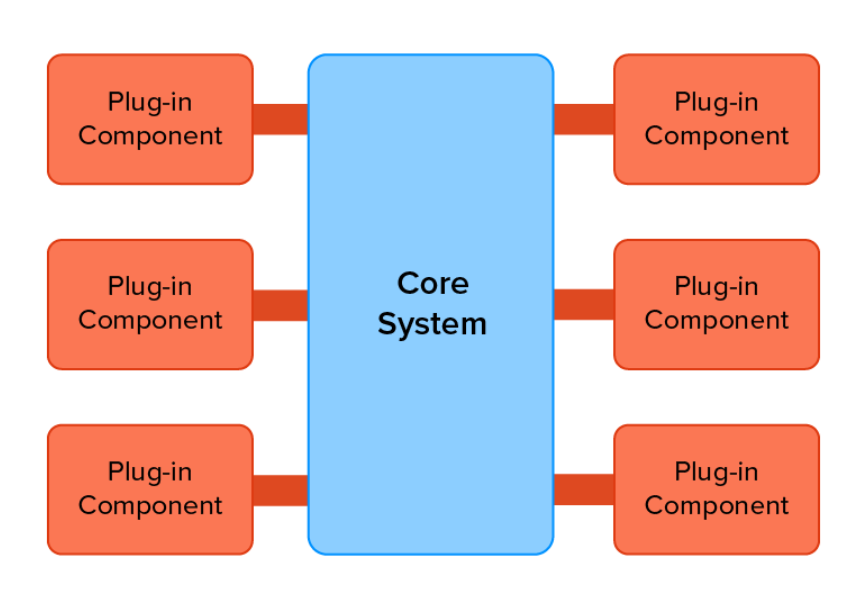

# Simple IDE Simulation with Microkernel Architecture

## Introduction

This project is a simple simulation of an Integrated Development Environment (IDE) using a microkernel architecture. The application is built with Node.js and demonstrates the core principles of a microkernel by allowing plugins to be dynamically registered and initialized.

## What is Microkernel Architecture?

A microkernel architecture is called a plugin architecture that structures an application into a minimal core system, known as the microkernel, and a set of plug-in modules. The core system provides the essential mechanisms, while additional functionalities are implemented in plugins that can be loaded and unloaded dynamically.

### Key Characteristics:
- **Minimal Core:** The microkernel contains only the essential functions and services.
- **Extensibility:** New features can be added without modifying the core system.
- **Isolation:** Plugins operate independently, reducing the impact of changes or failures in one plugin on others.
- **Flexibility:** The system can be easily adapted to different requirements by adding or removing plugins.

### When to Use Microkernel Architecture?
- **Extensible Systems:** Applications that require frequent updates and feature additions.
- **Plug-in-based Applications:** Systems like IDEs, browsers, and media players that need to support various extensions or plugins.
- **High Availability:** Systems where stability and reliability are critical, and isolating faults is important.

### Disadvantages of Microkernel Architecture
- **Performance Overhead:** Due to the frequent communication between the microkernel and plugins, there may be performance overhead compared to a monolithic architecture.
- **Complexity:** Designing and implementing a microkernel system can be more complex, especially in terms of ensuring efficient communication and managing dependencies between the core and plugins.
- **Initial Development Effort:** The initial development of the microkernel and the infrastructure to support plugins may require more effort compared to a simpler architecture.
- **Debugging and Testing:** Isolating issues and ensuring thorough testing can be more challenging due to the distributed nature of the system.

### Running the Application:
- Clone the repository and navigate to the project directory.
- Ensure you have Node.js installed.
- Install the dependencies: npm install
- Run the application using Node.js: npm start
- Running the Tests: npm test
